# Jarkom-Modul-1-D05-2023

### Anggota Kelompok
1. Ihsan Widagdo (5025211231)
2. Sandyatama Fransisna Nugraha (5025211196)

# Soal 1

### User melakukan berbagai aktivitas dengan menggunakan protokol FTP. Salah satunya adalah mengunggah suatu file.

a. Berapakah sequence number (raw) pada packet yang menunjukkan aktivitas tersebut? 
b. Berapakah acknowledge number (raw) pada packet yang menunjukkan aktivitas tersebut? 
c. Berapakah sequence number (raw) pada packet yang menunjukkan response dari aktivitas tersebut?
d. Berapakah acknowledge number (raw) pada packet yang menunjukkan response dari aktivitas tersebut?

## Langkah-Langkah
### 1. Mencari koneksi dengan kata kunci zip dengan menggunakan ftp contains "zip"
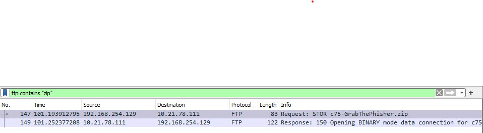

### 2. Akan ada hasil seperti ini
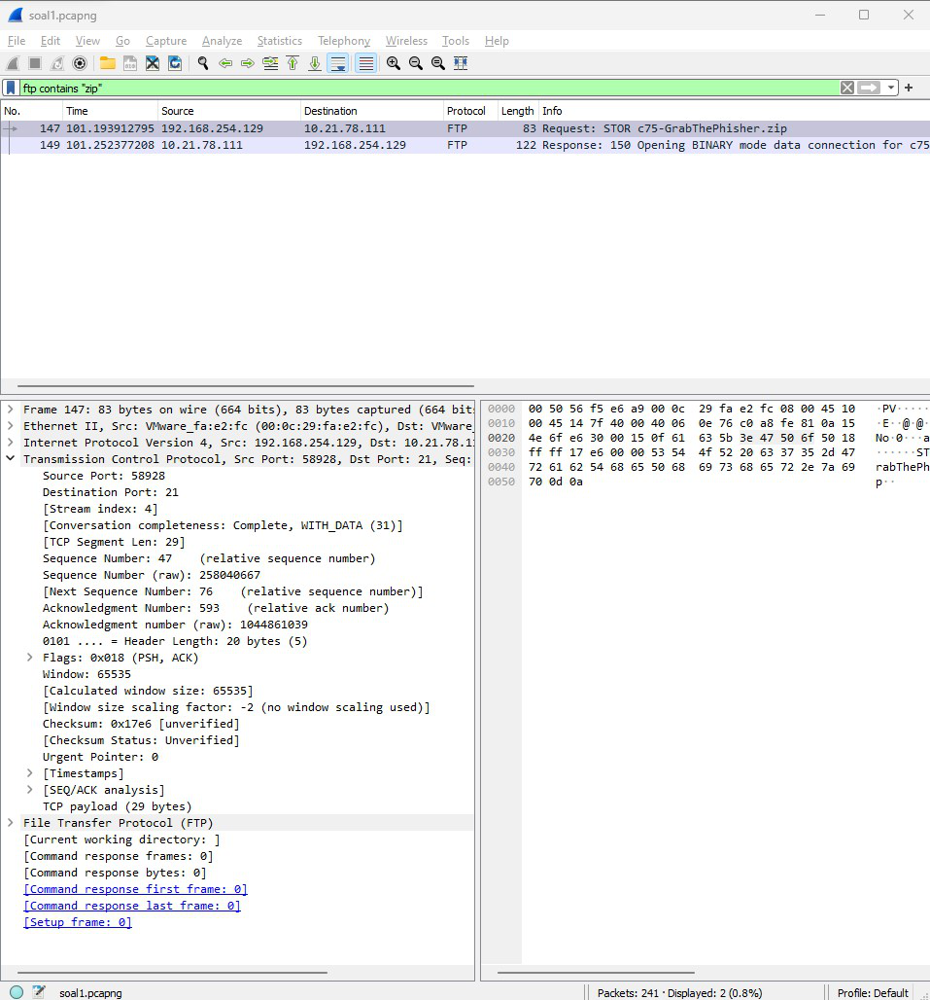

### 3. Lihat dengan detail pada bagian ini 

#### Bagian pertama
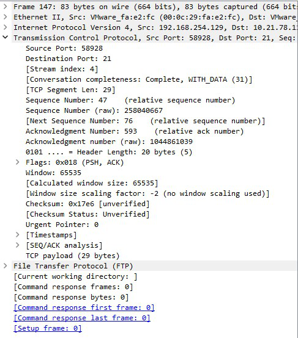

#### Bagian pertama
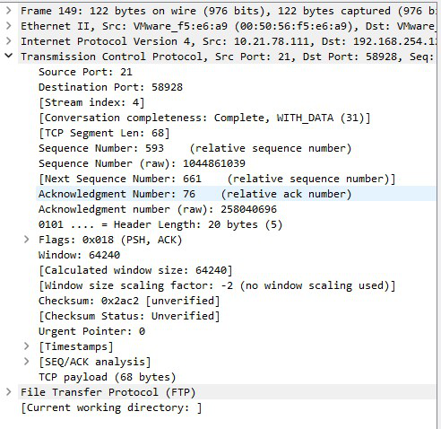

### 4. Hasilnya adalah seperti ini 
a. 258040667
b. 1044861039
c. 1044861039
d. 258040696

 

# Soal 2

### Sebutkan web server yang digunakan pada portal praktikum Jaringan Komputer!

## Langkah-Langkah
### 1. Mencari koneksi dengan kata kunci ip.dst == 10.21.78.111 untuk mencari tujuan koneksi ip dan klik pada port 1089
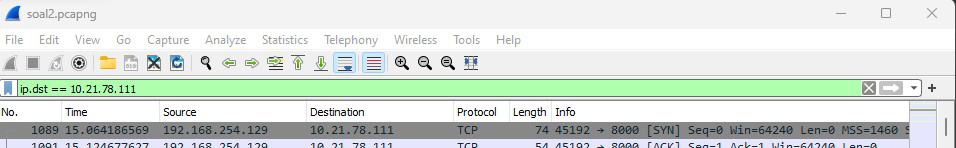

### 2. Lalu buka menu follow dan tcp stream
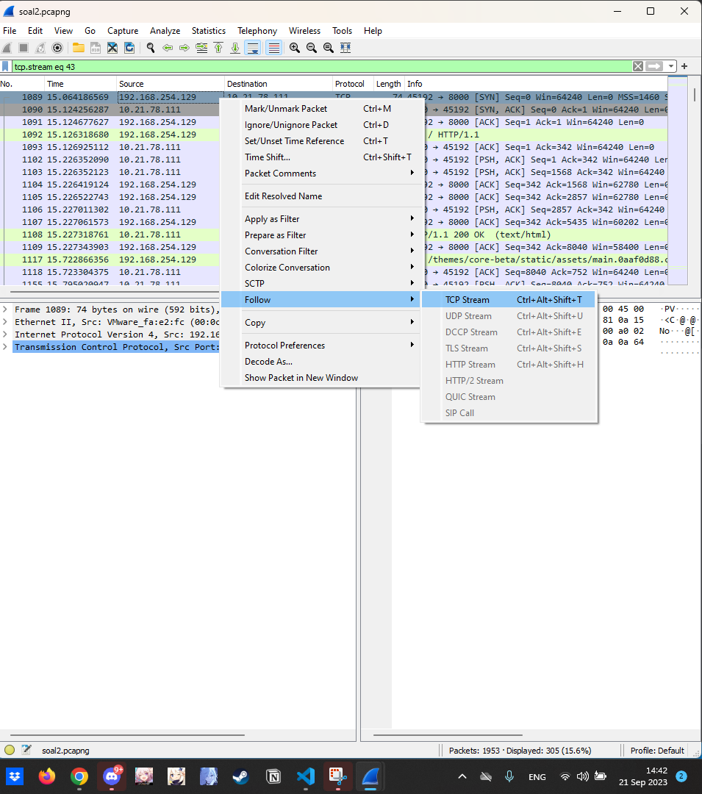

### 3. Akan ada hasil output seperti ini

#### Keseluruhan
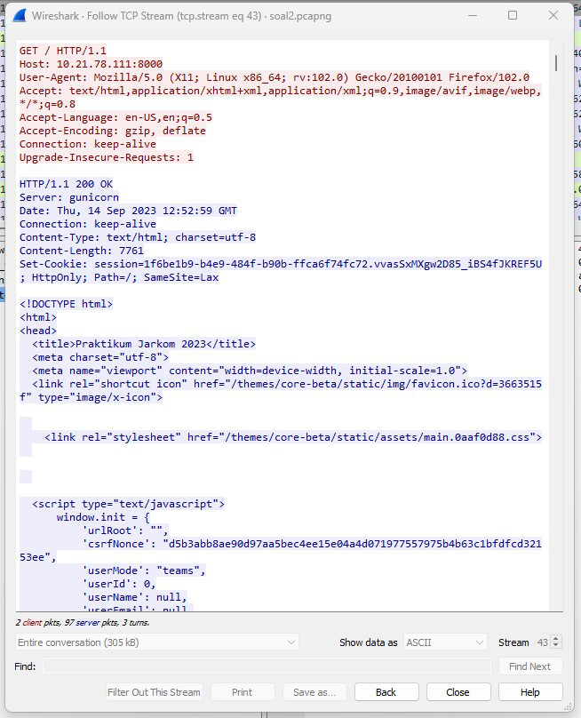

#### Nama Server
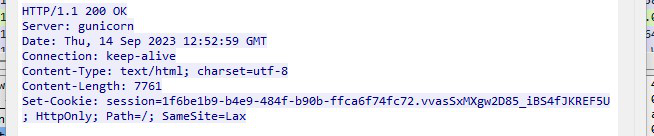

### Hasilnya adalah gunicorn

 

# Soal 3

### Dapin sedang belajar analisis jaringan. Bantulah Dapin untuk mengerjakan soal berikut:

a. Berapa banyak paket yang tercapture dengan IP source maupun destination address adalah 239.255.255.250 dengan port 3702?
b. Protokol layer transport apa yang digunakan?

 

## Langkah-Langkah
### 1. Mencari koneksi dengan kata kunci (ip.src == 239.255.255.250 or ip.dst == 239.255.255.250) && udp.port == 3702 untuk menfilter ip source dengan port 3702

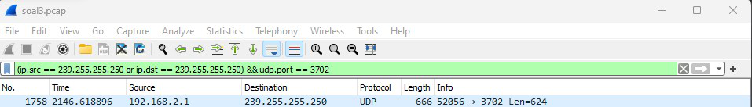

### 2. Lalu akan ada hasil output seperti ini
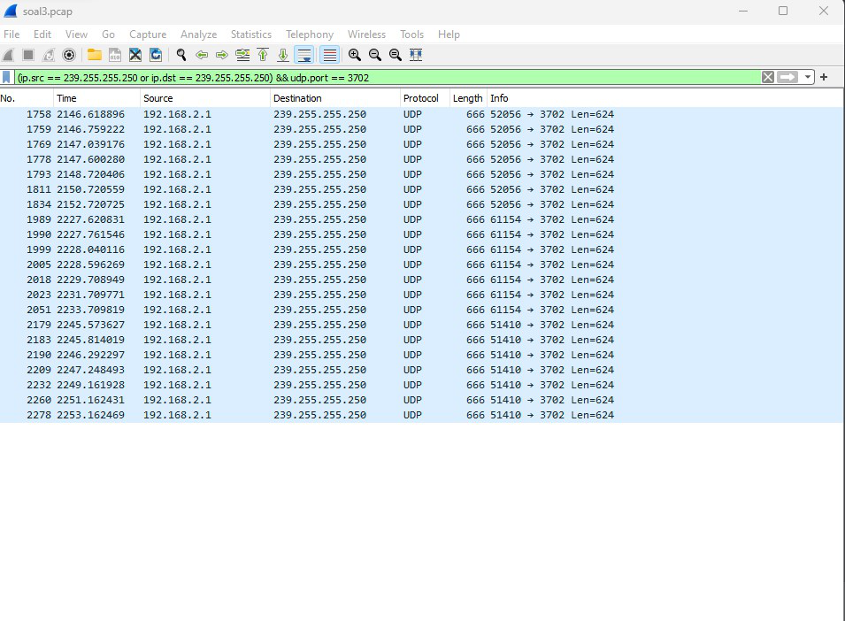

### 3. Hitung total ip yang tertera disini

#### Jumlah Ip = 21
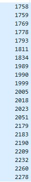

#### Protokol layer yang digunakan adalah UDP
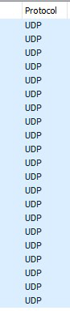

# Soal 4

### Berapa nilai checksum yang didapat dari header pada paket nomor 130?

## Langkah-Langkah
### 1. Ini adalah tampilan muka soal no 4

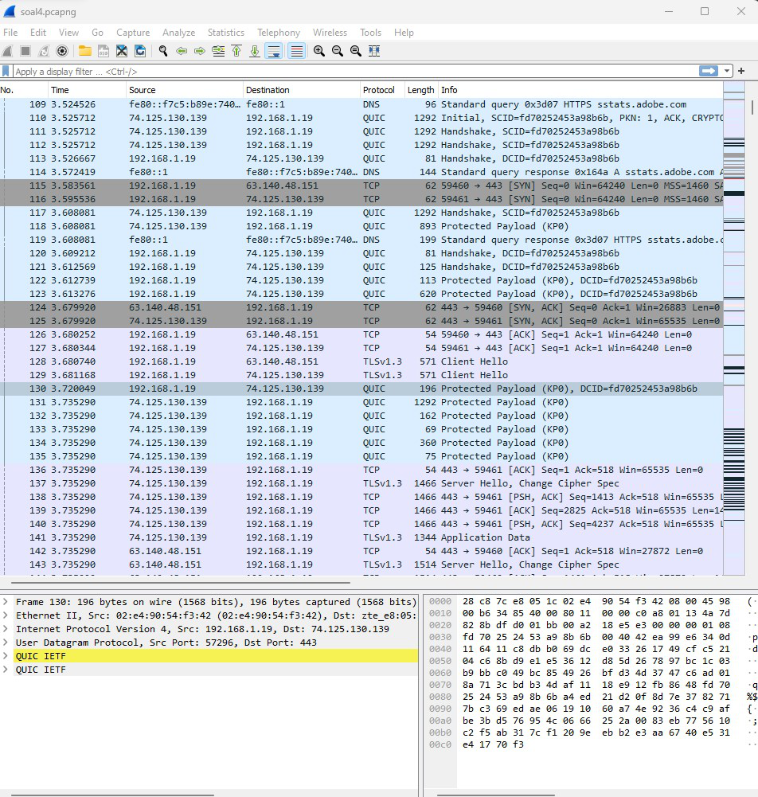

### 2. Lalu cari nomor urutan ke 130
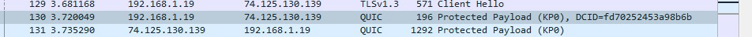

### 3. Cek User Data Protocol

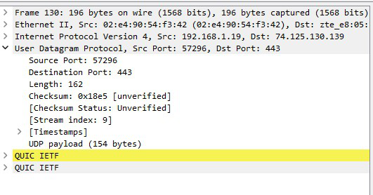

### 4. Hasil nilai checksum yang didapat adalah 0x18e5
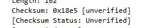

## Soal 5 

### Elshe menemukan suatu file packet capture yang menarik. Bantulah Elshe untuk menganalisis file packet capture tersebut.

a. Berapa banyak packet yang berhasil di capture dari file pcap tersebut?
b. Port berapakah pada server yang digunakan untuk service SMTP? 
c. Dari semua alamat IP yang tercapture, IP berapakah yang merupakan public IP?

## Langkah-Langkah
### 1. Dikarenakan kita tidak memiliki nc (soal), maka kita harus mendownload folder dan memecahkan kata sandinya
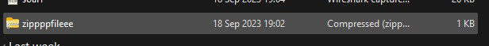

### 2. Akan ada hasil seperti ini
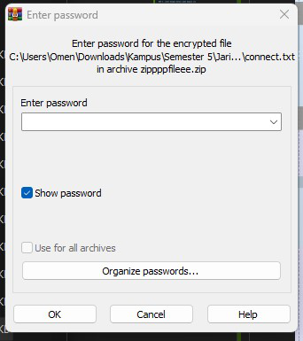

### 3. Untuk itu, kita harus mencari kata sandi yang tersembunyi di dalam wireshark

### 4. Mencari password dari zip file
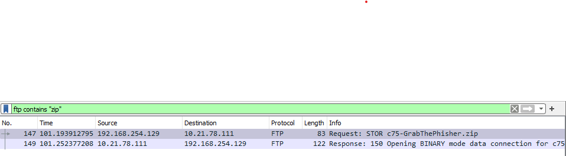

### 5. Mendecode melalui base64
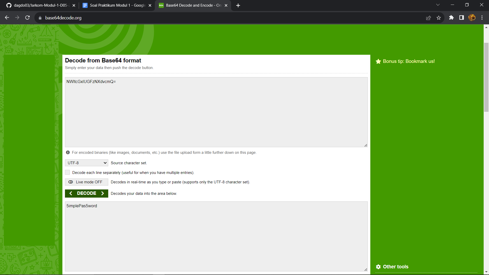

### 6. Memfilter untuk mendapatkan jumlah packet yang dicapture
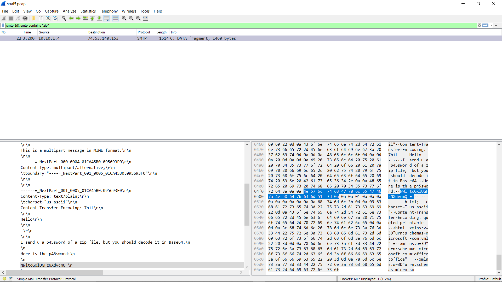

### 7. Mendapatkan source port yang digunakan pada service SMTP
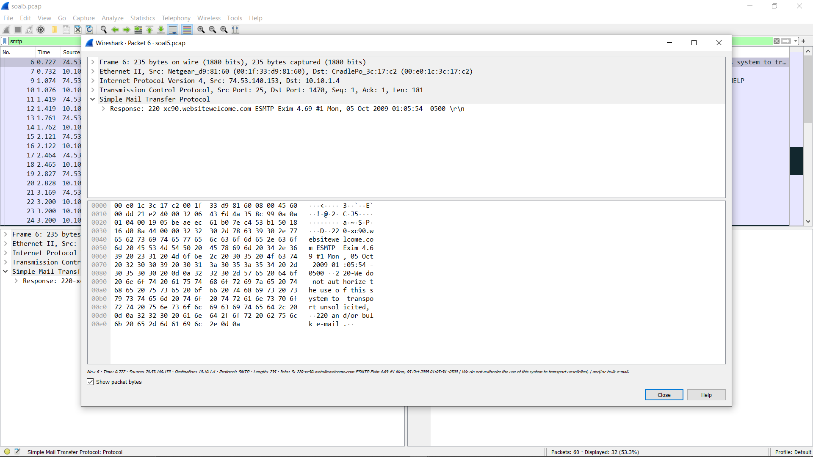

### 8. Public ip merupakan ip yang tidak diawali dengan angka 10
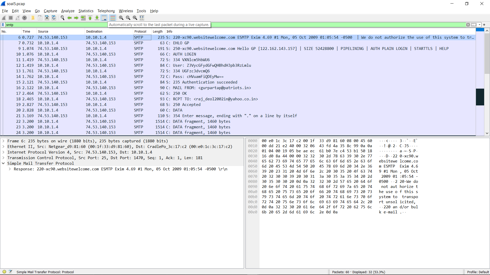

## Soal 6

### Seorang anak bernama Udin Berteman dengan SlameT yang merupakan seorang penggemar film detektif. sebagai teman yang baik, Ia selalu mengajak slamet untuk bermain valoranT bersama. suatu malam, terjadi sebuah hal yang tak terdUga. ketika udin mereka membuka game tersebut, laptop udin menunjukkan sebuah field text dan Sebuah kode Invalid bertuliskan "server SOURCE ADDRESS 7812 is invalid". ketika ditelusuri di google, hasil pencarian hanya menampilkan a1 e5 u21. jiwa detektif slamet pun bergejolak. bantulah udin dan slamet untuk menemukan solusi kode error tersebut

## Langkah-Langkah
### 1. Kita diminta untuk subtitusi source ip pada paket nomor 7812
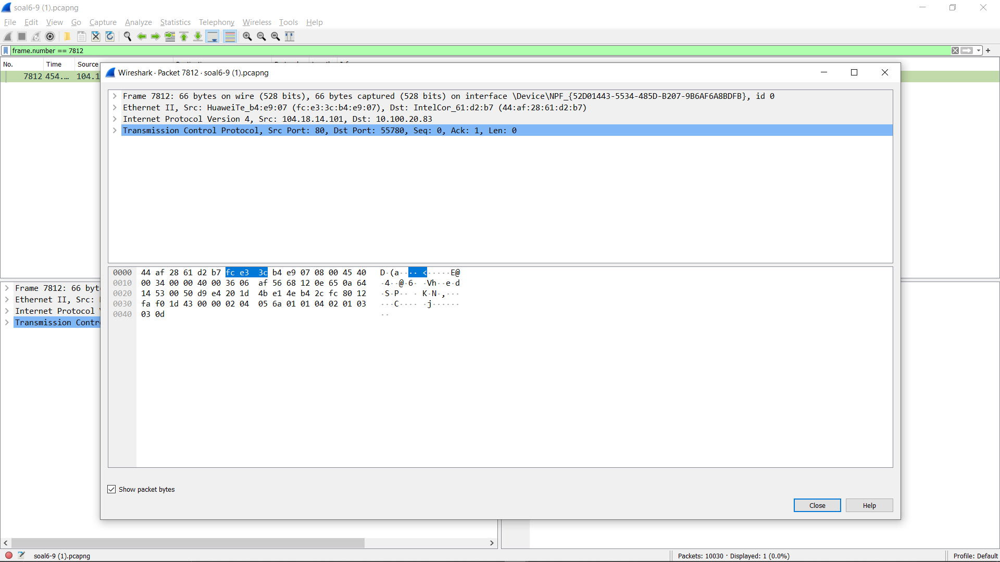

### 2. Mensubtitusi dengan aturan chiper di mana angka 1 adalah huruf a dan seterusnya, dengan batas angka 18 maka didapatkan hasil JDRNJA

## Soal 7

### Berapa jumlah packet yang menuju IP 184.87.193.88?

## Langkah-Langkah
### 1. Menggunakan queri filter pada wireshark sebagai berikut
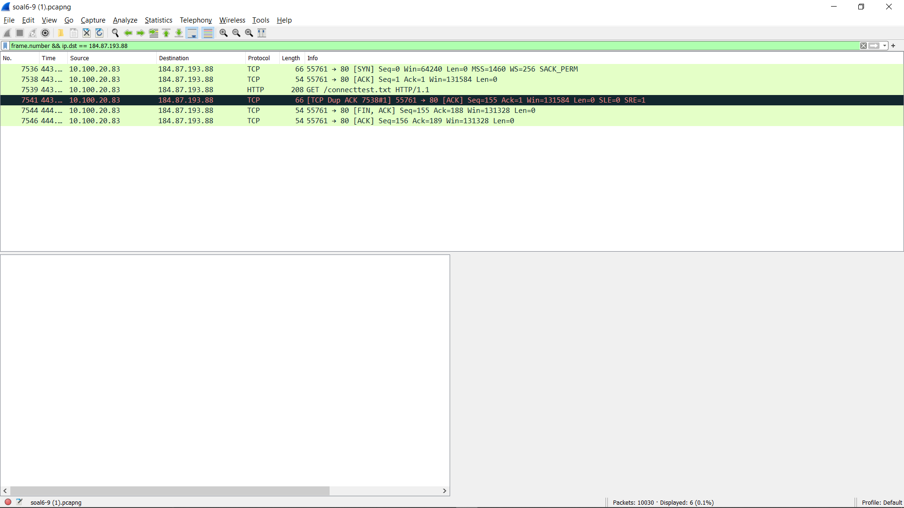

### 2. Didapatkan hasil 6 paket yang tercapture

## Soal 8
### Berikan kueri filter sehingga wireshark hanya mengambil semua protokol paket yang menuju port 80! (Jika terdapat lebih dari 1 port, maka urutkan sesuai dengan abjad)

## Langkah-Langkah
### 1. tcp.dstport == 80 || udp.dstport == 80

## Soal 9
### Berikan kueri filter sehingga wireshark hanya mengambil paket yang berasal dari alamat 10.51.40.1 tetapi tidak menuju ke alamat 10.39.55.34!

## Langkah-Langkah
### 1. ip.src == 10.51.40.1 && ip.dst != 10.39.55.34

## Soal 10
### Sebutkan kredensial yang benar ketika user mencoba login menggunakan Telnet

## Langkah-Langkah
### 1. Memfilter untuk mendapatkan kredensial selain admin
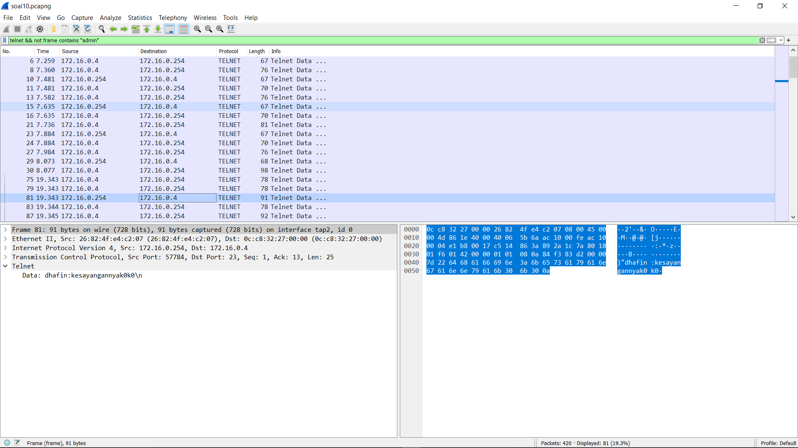

### 2. Didapatkan kredensial yaitu, dhafin:kesayangannyak0k0
